<!-- REPLACE ALL THE [WiaanDuvenhage-200307] TEXT WITH YOUR GITHUB PROFILE NAME & THE [salubrious] WITH THE NAME OF YOUR GITHUB PROJECT -->

<!-- Repository Information & Links-->
<br />


<!-- HEADER SECTION -->
<h5 align="center" style="padding:0;margin:0;">Wiaan Duvenhage</h5>
<h5 align="center" style="padding:0;margin:0;">200307</h5>
<h6 align="center">DV200 | Term 2</h6>
</br>
<p align="center">

  <a href="https://github.com/WiaanDuvenhage-200307/salubrious">
    
  </a>
  
  <h3 align="center">Salubrious</h3>

  <p align="center">
    A React project built with React, PHP & MySQL .<br>
    
   <br />
   <br />
   <a href="https://youtu.be/Oag-DdqW9jA">View Demo</a>
    ·
    <a href="https://github.com/WiaanDuvenhage-200307/salubrious/issues">Report Bug</a>
    ·
    <a href="https://github.com/WiaanDuvenhage-200307/salubrious/issues">Request Feature</a>
</p>
<!-- TABLE OF CONTENTS -->

## Table of Contents

- [About the Project](#about-the-project)
  - [Project Description](#project-description)
  - [Built With](#built-with)
- [Getting Started](#getting-started)
  - [Prerequisites](#prerequisites)
  - [How to install](#how-to-install)
- [Features and Functionality](#features-and-functionality)
- [Concept Process](#concept-process)
  - [Ideation](#ideation)
  - [Wireframes](#wireframes)
- [Development Process](#development-process)
  - [Implementation Process](#implementation-process)
    - [Highlights](#highlights)
    - [Challenges](#challenges)
  - [Future Implementation](#peer-reviews)
- [Final Outcome](#final-outcome)
  - [Mockups](#mockups)
  - [Video Demonstration](#video-demonstration)
- [Conclusion](#conclusion)
- [License](#license)
- [Contact](#contact)
- [Acknowledgements](#acknowledgements)

<!--PROJECT DESCRIPTION-->

## About the Project

<!-- header image of project -->

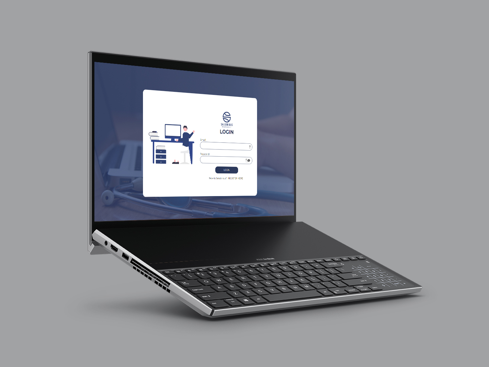

### Project Description

Welcome to Salubrious! This is a receptionists management portal that I built using React, PHP & MySQL. It is a CRUD-system that can create, read, update & delete.

### Built With

- [React](https://reactjs.org/)
- [PHP](https://www.php.net/)
- [MySQL](https://www.mysql.com/)
- [MAMP for Windows](https://www.mamp.info/en/windows/)
- [tailwindcss](https://tailwindcss.com/)

<!-- GETTING STARTED -->
<!-- Make sure to add appropriate information about what prerequesite technologies the user would need and also the steps to install your project on their own mashines -->

## Getting Started

The following instructions will get you a copy of the project up and running on your local machine for development and testing purposes.

### Installation

Here are a couple of ways to clone this repo:

1.  GitHub Desktop </br>
    Enter `https://github.com/WiaanDuvenhage-200307/salubrious.git` into the URL field and press the `Clone` button.

2.  Clone Repository </br>
    Run the following in the command-line to clone the project:

    ```sh
    git clone https://github.com/WiaanDuvenhage-200307/salubrious.git
    ```

        Open `Software` and select `File | Open...` from the menu. Select cloned directory and press `Open` button

3.  Install Dependencies </br>
    Run the following in the command-line to install all the required dependencies:

    ```sh
    npm install
    ```

<!-- FEATURES AND FUNCTIONALITY-->
<!-- You can add the links to all of your imagery at the bottom of the file as references -->

## Features and Functionality

<!-- note how you can use your gitHub link. Just make a path to your assets folder -->

### Adding an Appointment

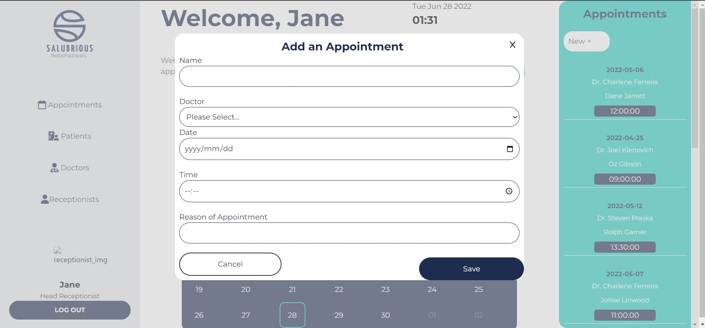
The receptionist can add an appointment by assigning a patient to a doctor. They can add the name, date and time and it will display on the page when the page auto-refreshes.

### Scroll Through Calendar

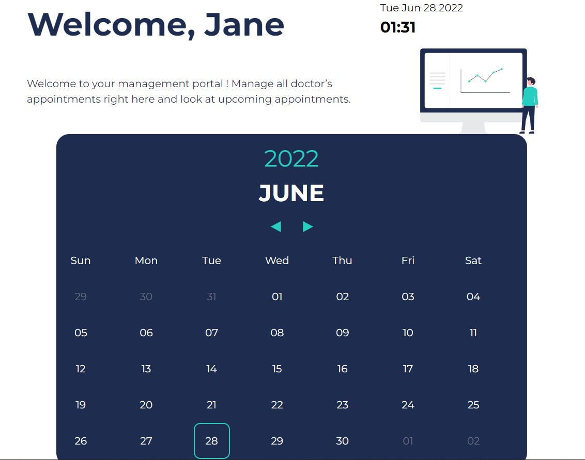
The receptionist can scroll through the calendar to see which date falls on which day, the receptionist can go forward or backward in time using the arrows underneath the month's name.

### Add Doctor/Patient


The receptionist can add a new doctor or patient's information into the modal and it will push to the database and display on the page after it refreshes. 

### Only Head Receptionist can add
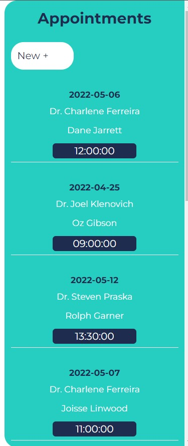
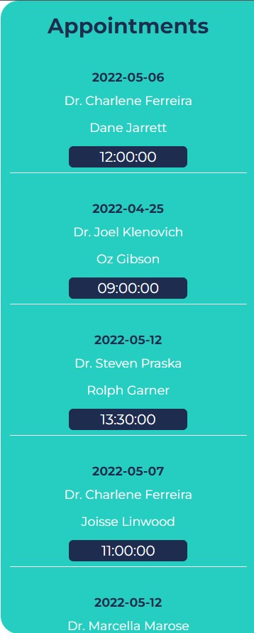
The head receptionist is the only one authorized to add, delete or update appointments, patients & doctors

<!-- CONCEPT PROCESS -->
<!-- Briefly explain your concept ideation process -->
<!-- here you will add things like wireframing, data structure planning, anything that shows your process. You need to include images-->

## Concept Process

It was very evident that blue is something that is very evident when designing dashboards or management portals for medical firms. So it is the route that I decided to go with Salubrious, I tried keeping it clean with different hue's of blue and some accents of a lime green.

### Wireframes

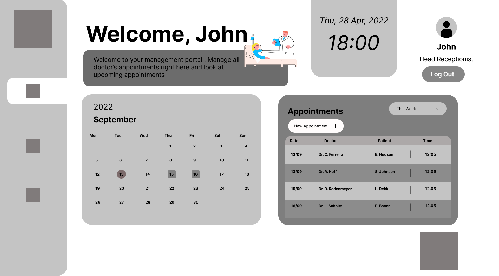
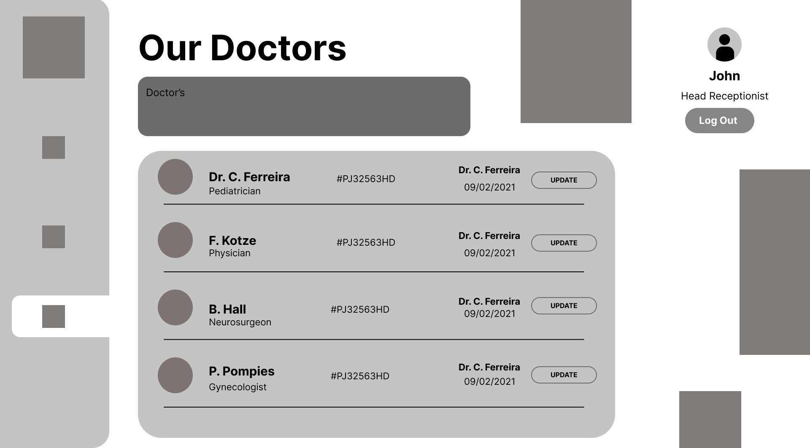
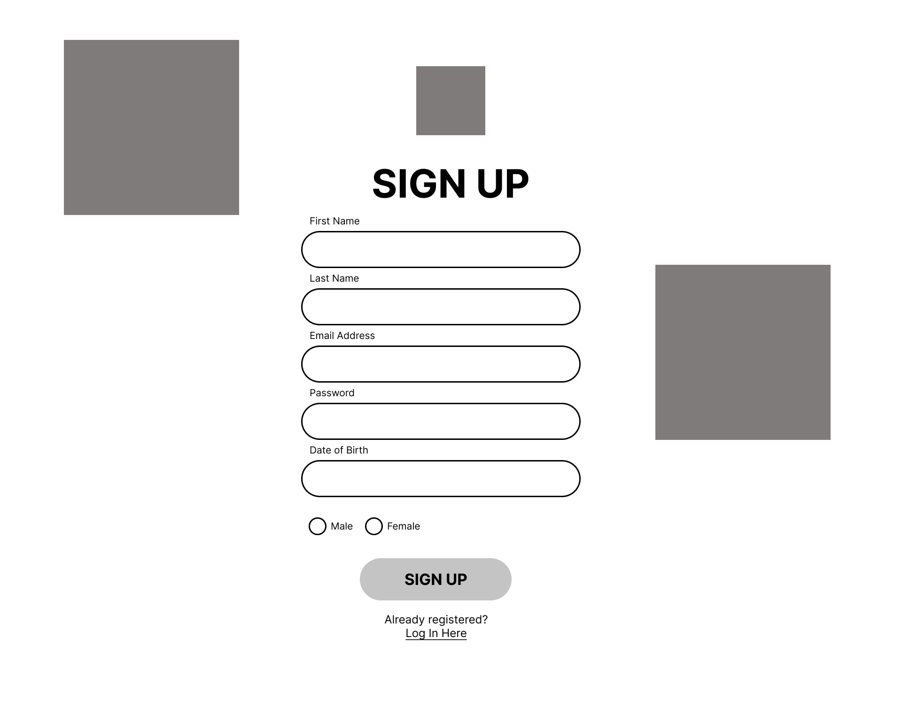

## Development Process

The `Development Process` is the technical implementations and functionality done in the frontend and backend of the application.

### Implementation Process

- I used `npx create-react app` to create this React project. I implemented component-based development instead of classes. By doing this, I will be able to easily inject and eject components and sub-components into my project, making it refactorable and reusable instead of writing up classes I have to do everytime making it tedious and redundant

- I implemented the `date-fns` dependency to manipulate and display the time & date the I wanted to and to create my calendar

- I incorporated `tailwindcss` to create and style my calendar component the way I wanted it to look

- `axios` was implemented so that I can make HTTP requests to the database server so that I can retrieve and push data to it

- I used `PHPMyAdmin` to alter data on the database and used PHP to talk to the backend MySQL database
 


#### Highlights

<!-- stipulated the highlight you experienced with the project -->

- A highlight of this project was defintely interacting with the database and manipulating data on the database and seeing it being displaye on the application.

#### Challenges

<!-- stipulated the challenges you faced with the project and why you think you faced it or how you think you'll solve it (if not solved) -->

- I struggled to get all my updates and deletes to be implemented.
- I struggled to get all my profile pictures to be updated and rendered on the DOM from the Database.
- debugging the CORS error's for sending data to the Database, especially my Register page's CORS error
- I struggled a lot with debugging the PHP error's
- Front-end was also a bit tricky because I kept following the trend of putting everything in blocks

#### Above And Beyond

<!-- TODO Change this! -->

The aspects I learned outside of this class, is that I implemented tailwindcss to create my calendar, I also incorporated the Date-fns dependency to render my calendar dates.

### Future Implementation

<!-- TODO Change this! -->

<!-- stipulate functionality and improvements that can be implemented in the future. -->

- I want to complete all my update and delete's of the patients and doctor's
- I want to fix my styling for my application
- I want to display the appointments by week
- I want to complete the profile pictures to be rendered and updated

<!-- MOCKUPS -->

## Final Outcome

### Mockups

<!-- TODO Change this -->

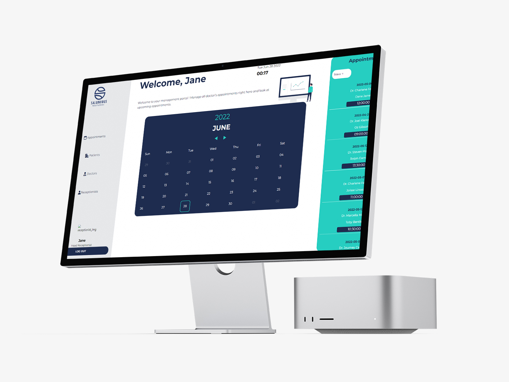

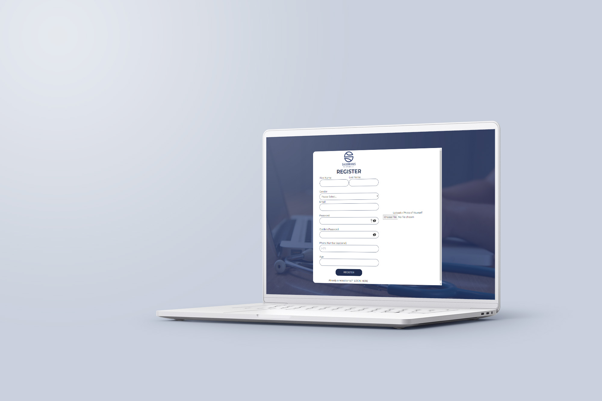
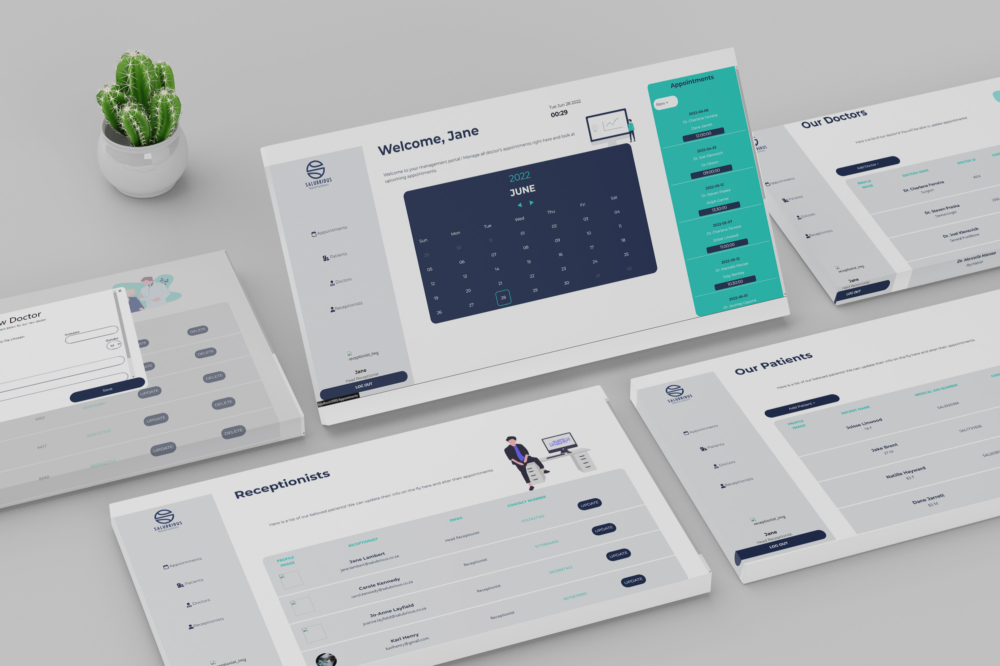
<br>


<!-- VIDEO DEMONSTRATION -->

### Video Demonstration

<!-- TODO Change this -->

To see a run through of the application, click below:

[View Demonstration](https://youtu.be/Oag-DdqW9jA)

See the [open issues](https://github.com/WiaanDuvenhage-200307/salubrious/issues) for a list of proposed features (and known issues).

<!-- AUTHORS -->

## Authors

- **Wiaan Duvenhage** - [Github](https://github.com/WiaanDuvenhage-200307)

<!-- LICENSE -->

## License

Distributed under the MIT License. See `LICENSE` for more information.\

<!-- LICENSE -->

## Contact

- **Wiaan Duvenhage** - [wiaanduvenhage.dev@gmail.com](mailto:wiaanduvenhage.dev@gmail.com) - [@wiaan.dev](https://www.instagram.com/wiaan.dev/)
- **Project Link** - https://github.com/WiaanDuvenhage-200307/salubrious

<!-- ACKNOWLEDGEMENTS -->

## Acknowledgements

<!-- all resources that you used and Acknowledgements here -->
<!-- TODO Change this -->

- [Stack Overflow](https://stackoverflow.com/)
- [Cooolors](https://coolors.co/)
- [Figma](https://www.figma.com/)
- [My Pinterest Board](https://za.pinterest.com/doubleudeedesigns/budget-app/)
- [(w3schools) SQL SELECT Statement](https://www.w3schools.com/sql/sql_select.asp)
- [Leander van Aarde](https://github.com/LeandervanAarde)
- [Vian Du Plessis](https://github.com/Vian-du-Plessis)